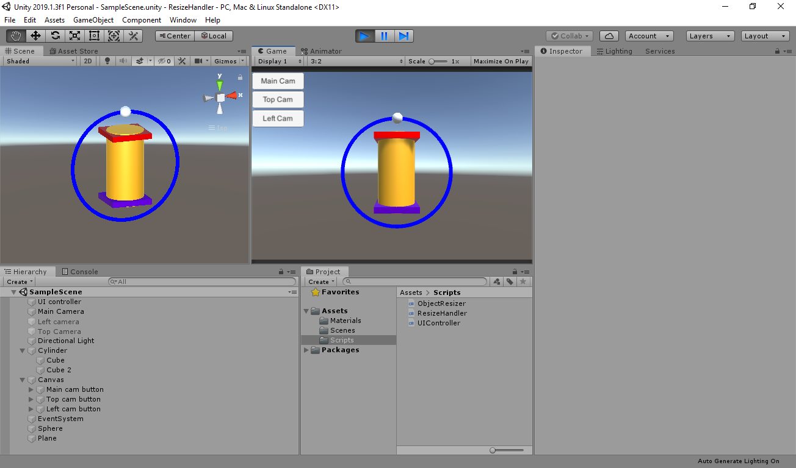
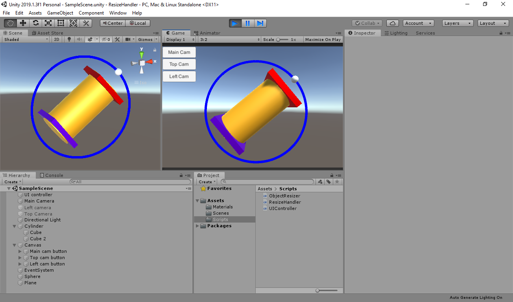
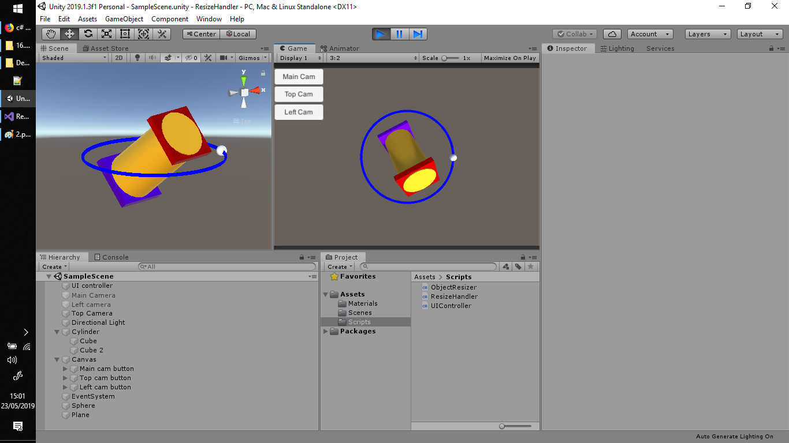

# ResizeHandler

Unity demo project which adds a handler to clicked objects, so they can be scaled/rotated freely (based on the camera view).

This demo project is an answer for this SO question:
https://gamedev.stackexchange.com/questions/168601/resize-game-object-using-single-drag-handle-using-unity

Te handler will always be facing the active camera - as long as the camera has the tag "MainCamera", and other cameras with this 
tag are disabled. It can be easily modified, though.

To use it, simply add the script "ObjectResizer.cs" to the object(s) that can be modified. Then click the object when in play mode.

There are few parameters, to keep the code simple, but if someone would like something fancier, feel free to ask (PM me).

Cheers!

